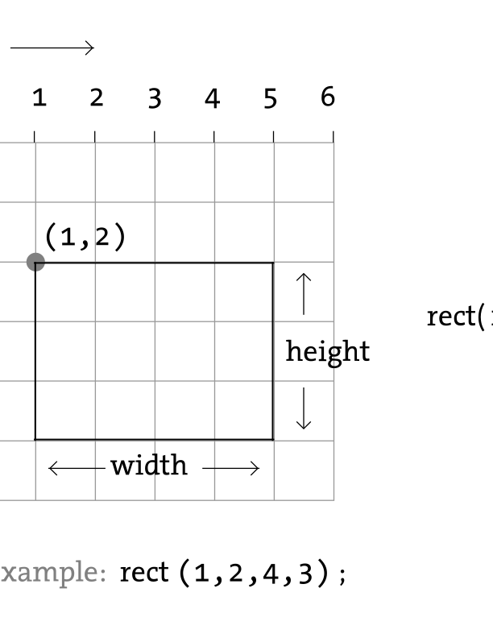

# Introducción

## Processing (Java)

[Processing][1] es un proyecto *open source* que fue creado en 2001 por [Ben Fry][2] y [Casey Reas][3] para permitir a estudiantes, artistas y diseñadores realizar **prototipos sencillos en el contexto de las artes visuales**. [Ben Fry][2] y [Casey Reas][3] desarrollaron una librería y un entorno de desarrollo que permitía realizar *sketches* sencillos utilizando el lenguaje de programación **Java**, que era el lenguaje de programación que estaba de moda en aquella época.

* [Web oficial del proyecto][1].
* [Repositorio en GitHub][13].

## P5.js (JavaScript)

[P5.js][4] es una librería *open source* para **JavaScript** creada en 2013 por [Lauren McCarthy][5] que permite realizar la misma funcionalidad de [Processing][1] pero sobre un navegador web.

* [Web oficial del proyecto][4].
* [Repositorio en GitHub][14].

## Processing.py (Python)

[Processing.py][9] es un proyecto *open source* desarrollado por [Jonathan Feinberg][10] que permite escribir *sketches* para [Processing][1] utilizando el lenguaje de programación **Python**. Este proyecto utiliza [Jython][11], que es una implementación de Python que se ejecuta sobre la **Java Virtual Machine** (JVM). La última versión de [Jython][11] implementa la **versión 2.7.3 de Python**.

* [Web oficial del proyecto][9].
* [Repositorio en GitHub][15].

## Processing.js (JavaScript)

[Processing.js][7] es un proyecto *open source* que fue creado en 2008 por [John Resig][8] que permite ejecutar un *sketch* de [Processing][1] con código **Java** sobre un navegador web. Lo que hace realmente [Processing.js][7] es convertir el código **Java** a código **JavaScript**.

Si consultamos la lista de proyectos que están siendo apoyados por la [Processing Foundation][12] veremos que aparecen todos los proyectos que hemos mencionado anteriormente excepto [Processing.js][7].

* [Web oficial del proyecto][7].
* [Repositorio en GitHub][16].

# Conceptos básicos

Todos los ejemplos que se muestren a partir de ahora estarán basados en [P5.js][4].

## Sistema de coordenadas

{style="display:block; margin:auto; height: 270px"}

## Formas básicas

### Point

{style="display:block; margin:auto; height: 270px"}

### Line

{style="display:block; margin:auto; height: 270px"}

### Rectangle

{style="display:block; margin:auto; height: 270px"}

{style="display:block; margin:auto; height: 270px"}

{style="display:block; margin:auto; height: 270px"}

### Ellipse

{style="display:block; margin:auto; height: 270px"}

{style="display:block; margin:auto; height: 270px"}

{style="display:block; margin:auto; height: 270px"}


## Colors


## Interact

```javascript
function setup() {
  createCanvas(500,400);
  background(0);
}

function draw() {
  stroke(255);
  fill(128);
  ellipse(mouseX, mouseY, 100, 100);
}
```

```javascript
function setup() {
  createCanvas(480, 120);
}

function draw() {
  if (mousePressed) {
    fill(0);
  } else {
    fill(255);
  }
  ellipse(mouseX, mouseY, 80, 80);
}
```

```javascript
function setup() {
  createCanvas(400, 400);
  stroke(255);
}

function draw() {
  background(192, 64, 0);
  line(150, 25, mouseX, mouseY);
}
```

# Créditos

* Las imágenes utilizadas en este documento han sido extraídas del tutorial [Coordinate System and Shapes](https://processing.org/tutorials/drawing/) de [Daniel Shiffman][6].

# Recursos

* [Learning Processing (Book)](http://learningprocessing.com). [Daniel Siffman][6].
* [Learning Processing (Videos)](https://www.youtube.com/user/shiffman/playlists?view=50&sort=dd&shelf_id=2).
* [Learning Processing (Examples)](https://github.com/shiffman/LearningProcessing).
* [Learning Processing (Examples using p5.js)](https://github.com/shiffman/LearningProcessing-p5.js).
* [The Nature of Code (Book)](http://natureofcode.com/book/).  [Daniel Siffman][6].
* [The Nature of Code (Videos)](https://www.youtube.com/user/shiffman/playlists?shelf_id=6&view=50&sort=dd).
* [p5.js tutorials - JavaScript, HTML, and CSS (Videos)](https://www.youtube.com/user/shiffman/playlists?shelf_id=14&view=50&sort=dd). [Daniel Siffman][6].
* https://creative-coding.decontextualize.com/

# Licencia

<a rel="license" href="http://creativecommons.org/licenses/by-sa/4.0/"></a><br />Esta obra está bajo una <a rel="license" href="http://creativecommons.org/licenses/by-sa/4.0/">licencia de Creative Commons Reconocimiento-CompartirIgual 4.0 Internacional</a>.

[1]: https://processing.org
[2]: https://en.wikipedia.org/wiki/Benjamin_Fry
[3]: https://en.wikipedia.org/wiki/C.E.B._Reas
[4]: https://p5js.org
[5]: http://lauren-mccarthy.com/about
[6]: http://shiffman.net
[7]: http://processingjs.org
[8]: https://johnresig.com
[9]: http://py.processing.org
[10]: http://mrfeinberg.com
[11]: http://www.jython.org
[12]: https://processingfoundation.org/projects
[13]: https://github.com/processing
[14]: https://github.com/processing/p5.js
[15]: https://github.com/jdf/processing.py
[16]: https://github.com/processing-js/processing-js/